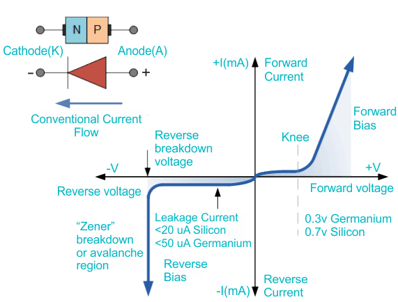

## Theory
A PN diode is a semiconductor device that allows current to flow in one direction only. It is formed by joining a P-type semiconductor and an N-type semiconductor. The IV (current-voltage) characteristics of a PN diode describe how the current through the diode varies with the applied voltage.

Forward Bias Characteristics
----------------------------

When a PN diode is forward-biased (positive voltage applied to the P-type side and negative voltage to the N-type side), the diode conducts current. The IV characteristics in this region show a small current flow at first, but as the applied voltage increases, the current rises exponentially. This is due to the reduction in the barrier potential, allowing charge carriers to cross the junction more easily.

The diode starts to conduct significantly when the forward voltage exceeds a certain threshold, typically around 0.7V for silicon diodes and 0.3V for germanium diodes.

Reverse Bias Characteristics
----------------------------

In reverse bias (positive voltage applied to the N-type side and negative voltage to the P-type side), the diode blocks current flow. The IV characteristics show a very small leakage current in this region, which remains nearly constant regardless of the applied reverse voltage. If the reverse voltage exceeds a certain value known as the breakdown voltage, the diode will start to conduct heavily in reverse, which is called breakdown. This is not ideal for standard diodes as it can damage the device.

Summary
-------

The IV characteristics of a PN diode exhibit:

*   **Forward Bias:** Exponential increase in current with increasing voltage after a threshold voltage.
*   **Reverse Bias:** Minimal leakage current until breakdown voltage is reached.

Understanding these characteristics is crucial for designing and analyzing circuits involving diodes, ensuring they function correctly within their intended applications.

**Fig. 1. Junction Diode Symbol and Static I-V Characteristics**

  

The current-voltage characteristic of a diode is described by the diode equation,

$$ I = I\_S\\left(\\exp\\left(\\frac{eV}{\\eta k\_BT}\\right) - 1\\right)\\hspace{0.5cm}\\text{\[A\]}.$$

Where I is the current, $$I_S$$ is the saturatuion current, eee is the charge of an electron, V is the voltage, $$k_B$$ is Boltzmann's constant, ηη\\eta is the nonideality factor and T is the absolute temperature. For a real diode there is always a resistance $$R_S$$ in series. This modifies the diode equation to,

$$I = I\_S\\left(\\exp\\left(\\frac{e(V-IR\_S)}{\\eta k\_BT}\\right) - 1\\right)\\hspace{0.5cm}\\text{\[A\]}.$$

This complicates the calculation since I now appears on both sides of the equation. However, such equations can be solved numerically, for instance by using a binary search. For a long diode, the saturation current can be written as,

$$ I\_S = Aen\_i^2\\left(\\frac{D\_p}{L\_pN\_d} + \\frac{D\_n}{L\_nN\_a}\\right).$$

Here A is the area of the diode perpendicular to the current flow, $$n_i$$ is the intrinsic carrier concentration, NdNdN\_d is the donor concentration, $$N_a$$ is the acceptor concentration, $$D_n$$ is the diffusion constant for electrons, $$D_p$$ is the diffusion constant for holes, $$L\_n=\\sqrt{D\_n\\tau\_n}$$ is the diffusion length for electrons, $$L\_p=\\sqrt{D\_p\\tau\_p}$$ is the diffusion constant for holes, $$\tau_n$$ is the minority carrier lifetime for electrons, and $$\tau_p$$ is the minority carrier lifetime for holes. The derivation of the saturation current assumes that the dominant current mechanism is diffusion as it is in forward bias. While this equation describes forward bias well, the measured diode current in reverse bias often differs significantly from $$-I_S$$.

The intrinsic carrier density is a strong function of temperature,

$$ n\_i=\\sqrt{N\_c\\left(\\frac{T}{300}\\right)^{3/2}N\_v\\left(\\frac{T}{300}\\right)^{3/2}}\\exp\\left(\\frac{-E\_g}{2k\_BT}\\right).$$

Here $$N_c$$ is the effective density of states in the conduction band at 300 K, NvNvN\_v is the effective density of states in the valence band at 300 K, and $$E_g$$ is the band gap. The temperture dependence of the band gap can be input into the form below. The diffusion constants are related to the mobilities by the Einstein relation,

$$ D\_n=\\frac{\\mu\_nk\_BT}{e}\\hspace{1.5cm}D\_p=\\frac{\\mu\_pk\_BT}{e},$$

where $$\mu_n$$ is the mobility of the electrons and $$\mu_p$$ is the mobility of the holes.
     
 
