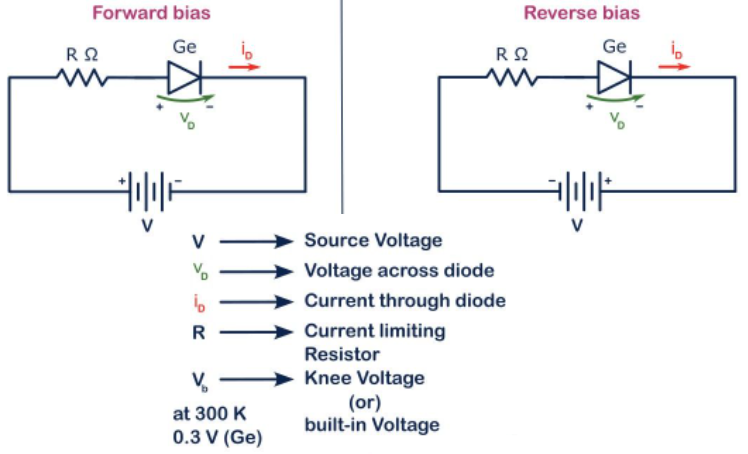

## Procedure

*   Gather the required equipment:
    *   PN junction diode
    *   Variable DC power supply
    *   Ammeter
    *   Voltmeter
    *   Connecting wires
    *   Resistor (optional, for current limiting)

  
**Fig. 1. Circuit diagram**

  

*   Set up the circuit for forward bias:
    *   Connect the anode of the diode to the positive terminal of the power supply.
    *   Connect the cathode of the diode to one terminal of the ammeter.
    *   Connect the other terminal of the ammeter to the negative terminal of the power supply.
    *   Connect the voltmeter across the diode to measure the voltage drop.

Procedure
---------

 
  
**Fig. 2. Transfer curve / V-I characteristics of diode**

  
*   Gradually increase the power supply voltage from 0V and record the current through the diode and the voltage across the diode at each step.
*   Continue increasing the voltage until a significant increase in current is observed, indicating the forward threshold voltage.
*   Turn off the power supply and set up the circuit for reverse bias:
    *   Connect the anode of the diode to the negative terminal of the power supply.
    *   Connect the cathode of the diode to one terminal of the ammeter.
    *   Connect the other terminal of the ammeter to the positive terminal of the power supply.
    *   Connect the voltmeter across the diode to measure the voltage drop.
*   Gradually increase the reverse bias voltage from 0V and record the current through the diode and the voltage across the diode at each step.
*   Continue increasing the voltage until the breakdown voltage is reached, where a significant increase in current is observed.
*   Turn off the power supply and disconnect the circuit.
*   Plot the IV characteristics of the diode using the recorded data, showing both the forward and reverse bias regions.
  
  

This procedure helps in understanding the behavior of a PN junction diode under different biasing conditions, providing practical insights into its IV characteristics.
